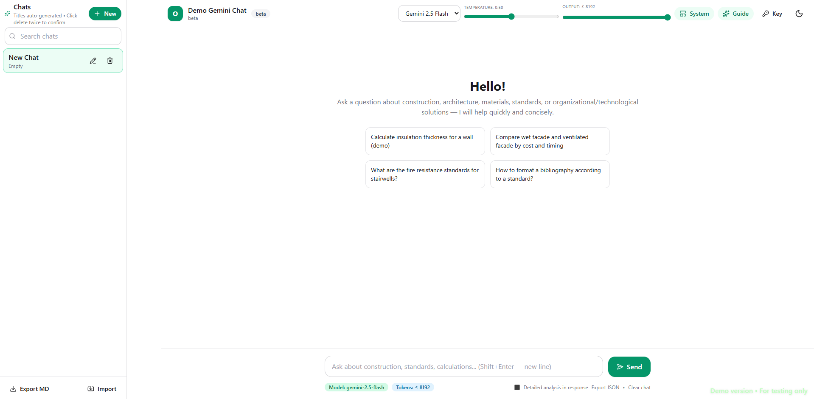
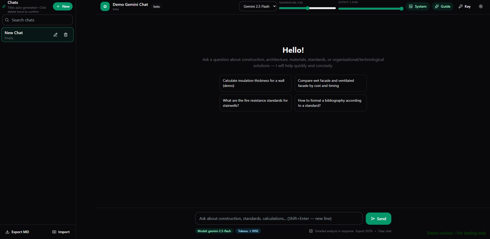

# ODABA Gemini Chat

A modern, single-file React application for AI-powered academic assistance using Google's Gemini API.

## Features

- 🤖 **AI Chat Interface** - Modern GPT-like UI with streaming responses
- 💬 **Multi-Chat Support** - Create, rename, delete, and manage multiple conversations
- 🎨 **Theme Support** - Light and dark themes with system preference detection
- 📱 **Responsive Design** - Works on desktop and mobile devices
- 💾 **Local Storage** - All chats and settings stored locally in your browser
- 📤 **Export Options** - Export conversations as Markdown or JSON
- ⚙️ **Model Control** - Adjust temperature, top-p, and max output tokens
- 🔍 **Search & Filter** - Quickly find specific conversations
- ⌨️ **Keyboard Shortcuts** - Ctrl+K (search), Ctrl+N (new chat), Ctrl+S (export)

## Screenshots




## Prerequisites

- Node.js 18+ and npm
- Google Gemini API key from [AI Studio](https://aistudio.google.com/)

## Quick Start

1. **Clone and install dependencies:**
   ```bash
   git clone <your-repo>
   cd odaba-gemini
   npm install
   ```

2. **Get your API key:**
   - Visit [Google AI Studio](https://aistudio.google.com/)
   - Create a new API key
   - Copy the key (starts with "AIza...")

3. **Run the development server:**
   ```bash
   npm run dev
   ```

4. **Add your API key:**
   - Click the "Key" button in the top-right corner
   - Paste your Gemini API key
   - Start chatting!

## Alternative Setup

You can also set your API key via environment variable:
```bash
# Create .env file
echo "VITE_GEMINI_API_KEY=your_key_here" > .env
npm run dev
```

## Building for Production

```bash
npm run build
npm run preview
```

## Chart.js Integration

For charts and tables in responses, add Chart.js to your `index.html`:
```html
<script src="https://cdn.jsdelivr.net/npm/chart.js"></script>
```

## Project Structure

```
src/
├── App.tsx          # Main application component
├── App.css          # Application styles
├── main.tsx         # Entry point
└── assets/          # Static assets
```

## Technologies Used

- **React 18** - UI framework
- **TypeScript** - Type safety
- **Tailwind CSS** - Styling
- **Framer Motion** - Animations
- **Lucide React** - Icons
- **Google GenAI** - Gemini API client
- **React Markdown** - Markdown rendering

## Development

```bash
npm run dev          # Start development server
npm run build        # Build for production
npm run preview      # Preview production build
npm run lint         # Run ESLint
```

## Contributing

1. Fork the repository
2. Create a feature branch
3. Make your changes
4. Submit a pull request

## License

This is a demo project for educational purposes.

## Support

For issues or questions, please open an issue on GitHub.
